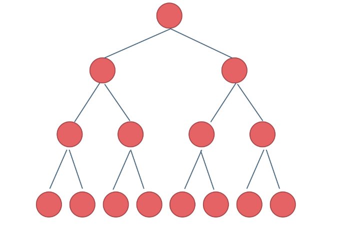

### 二叉树理论基础

#### 二叉树的种类

##### 满二叉树

满二叉树：如果一棵二叉树只有度为0的结点和度为2的结点，并且度为0的结点在同一层上，则这棵二叉树为满二叉树。

深度为K,节点数为2^k-1



##### 完全二叉树

**一棵二叉树是满二叉树, 则它必定是完全二叉树**

在完全二叉树中，除了最底层节点可能没填满外，其余每层节点数都达到最大值，并且最下面一层的节点都集中在该层最左边的若干位置。若最底层为第 h 层，则该层包含 1~ 2^(h-1)  个节点。**且最后一层的节点都连续集中在最左边**。


##### 二叉搜素树

前面介绍的树，都没有数值的，而二叉搜索树是有数值的了，**二叉搜索树是一个有序树**。

- **若它的左子树不空，则左子树上所有结点的值均小于它的根结点的值；**
- **若它的右子树不空，则右子树上所有结点的值均大于它的根结点的值；**
- 它的左、右子树也分别为二叉排序树

下面这两棵树都是搜索树


##### 平衡二叉搜索树


平衡二叉搜索树：又被称为AVL（Adelson-Velsky and Landis）树，且具有以下性质：**它是一棵空树或它的左右两个子树的高度差的绝对值不超过1，并且左右两个子树都是一棵平衡二叉树。**

==**C++中map、set、multimap，multiset的底层实现都是平衡二叉搜索树**，所以map、set的增删操作时间时间复杂度是logn，注意我这里没有说unordered_map、unordered_set，unordered_map、unordered_map底层实现是哈希表。==


#### 二叉树的储存方式

二叉树可以链式储存，也可以顺序储存

那么**链式存储方式就用指针**， **顺序存储的方式就是用数组**。

顾名思义就是顺序存储的元素在内存是连续分布的，而链式存储则是通过指针把分布在散落在各个地址的节点串联一起。


- 链式


- 顺序

  

**如果父节点的数组下标是 i，那么它的左孩子就是 i \* 2 + 1，右孩子就是 i \* 2 + 2。**

但是用链式表示的二叉树，更有利于我们理解，所以一般我们都是用链式存储二叉树。

**所以大家要了解，用数组依然可以表示二叉树。**


#### 二叉树的遍历方式

1. **深度优先遍历**：先往深走，遇到叶子节点再往回走。
2. **广度优先遍历**：一层一层的去遍历。
3. 

**这两种遍历是图论中最基本的两种遍历方式**，后面在介绍图论的时候 还会介绍到。

那么从深度优先遍历和广度优先遍历进一步拓展，才有如下遍历方式：

- 深度优先遍历
  - **前序遍历（递归法，迭代法）**
  - **中序遍历（递归法，迭代法）**
  - **后序遍历（递归法，迭代法）**
- 广度优先遍历
  - **层次遍历（迭代法）**

****

**之前我们讲栈与队列的时候，就说过栈其实就是递归的一种是实现结构**，也就说前中后序遍历的逻辑其实都是可以借助栈使用非递归的方式来实现的。

而广度优先遍历的实现一般使用队列来实现，这也是队列先进先出的特点所决定的，因为需要先进先出的结构，才能一层一层的来遍历二叉树。


#### 二叉树的定义

```python
class TreeNode:
     def __init__(self, val=0, left=None, right=None):
         self.val = val
         self.left = left
         self.right = right
```


### 二叉树的递归遍历（深度优先遍历）

#### 前序遍历

[144. 二叉树的前序遍历 - 力扣（LeetCode）](https://leetcode.cn/problems/binary-tree-preorder-traversal/)

中=>左=>右

```python
## 递归法
class TreeNode:
     def __init__(self, val=0, left=None, right=None):
         self.val = val
         self.left = left
         self.right = right
	def preorderTraversal(self, root): 
        res = []
        def Traversal(root):
            if  not root:
                return
            res.append(root.val)
            Traversal(root.left)
            Traversal(root.right)
        Traversal(root)
        return res
  
## 迭代法
class Solution:
    def preorderTraversal(self, root: TreeNode) -> List[int]:
        result = []
        st= []
        if root:
            st.append(root)
        while st:
            node = st.pop()
            if node != None:
                if node.right: #右
                    st.append(node.right)
                if node.left: #左
                    st.append(node.left)
                st.append(node) #中
                st.append(None)
            else:
                node = st.pop()
                result.append(node.val)
        return result
```

#### 中序遍历
左=》中=》右

[94. 二叉树的中序遍历 - 力扣（LeetCode）](https://leetcode.cn/problems/binary-tree-inorder-traversal/)


```python
#` Definition for a binary tree node.
 class TreeNode:
     def __init__(self, val=0, left=None, right=None):
         self.val = val
         self.left = left
         self.right = right
class Solution:
    def inorderTraversal(self, root):
        res=[]
        def Traversal(root):
            if not root:
                return
            Traversal(root.left)
            res.append(root.val)
            Traversal(root.right)    
        Traversal(root)
        return res
    
 ## 迭代法
class Solution:
    def inorderTraversal(self, root: TreeNode) -> List[int]:
        result = []
        st = []
        if root:
            st.append(root)
        while st:
            node = st.pop()
            if node != None:
                if node.right: #添加右节点（空节点不入栈）
                    st.append(node.right)
                
                st.append(node) #添加中节点
                st.append(None) #中节点访问过，但是还没有处理，加入空节点做为标记。
                
                if node.left: #添加左节点（空节点不入栈）
                    st.append(node.left)
            else: #只有遇到空节点的时候，才将下一个节点放进结果集
                node = st.pop() #重新取出栈中元素
                result.append(node.val) #加入到结果集
        return result
```


#### 后序遍历

左=>s右=>中

```python
class Solution:
    def postorderTraversal(self, root: TreeNode) -> List[int]:
        result = []

        def traversal(root: TreeNode):
            if root == None:
                return
            traversal(root.left)    # 左
            traversal(root.right)   # 右
            result.append(root.val) # 后序

        traversal(root)
        return result
    
### 迭代法
class Solution:
    def postorderTraversal(self, root: TreeNode) -> List[int]:
        result = []
        st = []
        if root:
            st.append(root)
        while st:
            node = st.pop()
            if node != None:
                st.append(node) #中
                st.append(None)
                
                if node.right: #右
                    st.append(node.right)
                if node.left: #左
                    st.append(node.left)
            else:
                node = st.pop()
                result.append(node.val)
        return result
```


### 二叉树层序遍历（广度优先搜索）

[102. 二叉树的层序遍历 - 力扣（LeetCode）](https://leetcode.cn/problems/binary-tree-level-order-traversal/submissions/)


### 

```python
# Definition for a binary tree node.
# class TreeNode:
#     def __init__(self, val=0, left=None, right=None):
#         self.val = val
#         self.left = left
#         self.right = right
class Solution:
    def levelOrder(self, root: Optional[TreeNode]) -> List[List[int]]:
        res = []
        if not root:
            return res
        # import queue
        que = []
        que.append(root) ## s加入根节点
        while que:
            size = len(que) ##查看队列中节点数量
            sub_res = []
            for _ in range(size):
                cur = que.pop(0) ## 弹出先进去的节点
                sub_res.append(cur.val)
                if cur.left: ## 如果有左节点，则加入
                    que.append(cur.left)
                if cur.right:##如果有右节点，则加入
                    que.append(cur.right)
            res.append(sub_res)
        return res

```


#### 翻转二叉树

[翻转二叉树](https://leetcode.cn/problems/invert-binary-tree/)

给你一棵二叉树的根节点 `root` ，翻转这棵二叉树，并返回其==**根节点**==。


```python

########  前序遍历法
class Solution:
    def invertTree(self, root: TreeNode) -> TreeNode:
        if not root:
            return None
        root.left, root.right = root.right, root.left #中
        self.invertTree(root.left) #左
        self.invertTree(root.right) #右
        return root

######### 层序遍历法

import collections
class Solution:
    def invertTree(self, root: TreeNode) -> TreeNode:
        queue = collections.deque() #使用deque()
        if root:
            queue.append(root)
        while queue:
            size = len(queue)
            for i in range(size):
                node = queue.popleft()
                node.left, node.right = node.right, node.left #节点处理
                if node.left:
                    queue.append(node.left)
                if node.right:
                    queue.append(node.right)
        return root
```


####  二叉树的层序遍历||


 [107. 二叉树的层序遍历 II](https://leetcode.cn/problems/binary-tree-level-order-traversal-ii/)

```python
# Definition for a binary tree node.
# class TreeNode:
#     def __init__(self, val=0, left=None, right=None):
#         self.val = val
#         self.left = left
#         self.right = right
class Solution:
    def levelOrderBottom(self, root: Optional[TreeNode]) -> List[List[int]]:
        import collections
        res =[]
        if not root:
            return res
        q = collections.deque([root])
        while q:
            size = len(q)
            seg_res = []
            for i in range(size):
                cur = q.popleft()
                seg_res.append(cur.val)
                if cur.left:
                    q.append(cur.left)
                if cur.right:
                    q.append(cur.right)
            res.append(seg_res)
        return res[::-1]  #《===修改点
        
```


#### 二叉树右视图

[199. 二叉树的右视图 - 力扣（LeetCode）](https://leetcode.cn/problems/binary-tree-right-side-view/)


```python
# Definition for a binary tree node.
# class TreeNode:
#     def __init__(self, val=0, left=None, right=None):
#         self.val = val
#         self.left = left
#         self.right = right
class Solution:
    def rightSideView(self, root: Optional[TreeNode]) -> List[int]:
        import collections
        res =[]
        if not root:
            return res
        q = collections.deque([root])
        while q:
            size = len(q)
            seg_res = []
            for i in range(size):
                cur = q.popleft()
                seg_res.append(cur.val)
                if cur.left:
                    q.append(cur.left)
                if cur.right:
                    q.append(cur.right)
            res.append(seg_res[-1]) #《===修改点
        return res
```

#### 层平局                                                                                                                                                                                                                                                                                                                                                                                                                                                                                                                                                                                                                                                                                                                                                                        

#### [N 叉树的层序遍历](https://leetcode.cn/problems/n-ary-tree-level-order-traversal/)


```python
class Solution:
    """N叉树的层序遍历迭代法"""

    def levelOrder(self, root: 'Node') -> List[List[int]]:
        results = []
        if not root:
            return results
        
        from collections import deque
        que = deque([root])
        
        while que:
            result = []
            for _ in range(len(que)):
                cur = que.popleft()
                result.append(cur.val)
                # cur.children 是 Node 对象组成的列表，也可能为 None
                if cur.children:
                    que.extend(cur.children)
            results.append(result)

        return results
```


#### [填充每个节点的下一个右侧节点指针 II](https://leetcode.cn/problems/populating-next-right-pointers-in-each-node-ii/)

本题依然是层序遍历，只不过在单层遍历的时候记录一下本层的头部节点，然后在遍历的时候让前一个节点指向本节点就可以了


```python
"""
# Definition for a Node.
class Node:
    def __init__(self, val: int = 0, left: 'Node' = None, right: 'Node' = None, next: 'Node' = None):
        self.val = val
        self.left = left
        self.right = right
        self.next = next
"""

class Solution:
    def connect(self, root: 'Node') -> 'Node':
        if not root:##返回空节点
            return None
        que = [root]
        while que:
            size = len(que)
            for i in range(size):
                cur = que.pop(0) #队列弹出的当当前节点
                if cur.left:
                    que.append(cur.left)
                if cur.right:
                    que.append(cur.right)
                
                if i== size -1:#每一层只构建一段
                    break
                    ##构建指针
                cur.next = que[0]
        return root
```


#### [101. 对称二叉树 - 力扣（LeetCode）](https://leetcode.cn/problems/symmetric-tree/)


```python

# Definition for a binary tree node.
# class TreeNode:
#     def __init__(self, val=0, left=None, right=None):
#         self.val = val
#         self.left = left
#         self.right = right
class Solution:
    def isSymmetric(self, root: Optional[TreeNode]) -> bool:
        if not root:
            return True
        
        def compare(left,right):
            if not left and not right:
                return True
            elif not left and right:
                return False
            elif left and not right:
                return False
            elif left.val != right.val:
                return False
                #二者都存在，但值不同
            ## 对称：
            #内部:左节点的左边，右节点的右边
            Inside = compare(left.right, right.left)
            Outside = compare(left.left, right.right)
            isSame = Outside and Inside #左子树：中、 右子树：中 （逻辑处理）
            return isSame
        return compare(root.left, root.right)
    
    
    
## 迭代法使用栈
class Solution:
    def isSymmetric(self, root: TreeNode) -> bool:
        if not root:
            return True
        st = [] #这里改成了栈
        st.append(root.left)
        st.append(root.right)
        while st:
            leftNode = st.pop()
            rightNode = st.pop()
            if not leftNode and not rightNode:
                continue
            if not leftNode or not rightNode or leftNode.val != rightNode.val:
                return False
            ## outside
            st.append(leftNode.left)
            st.append(rightNode.right)
            
            ## inside
            st.append(leftNode.right)
            st.append(rightNode.left)
        return True
```

##### [100. 相同的树 - 力扣（LeetCode）](https://leetcode.cn/problems/same-tree/)


```python
# Definition for a binary tree node.
# class TreeNode:
#     def __init__(self, val=0, left=None, right=None):
#         self.val = val
#         self.left = left
#         self.right = right
class Solution:
    def isSameTree(self, p: Optional[TreeNode], q: Optional[TreeNode]) -> bool:
        if not p and not q:
            # 走到底，为True
            return True
        if not p or not q:
            return False
        if p.val != q.val:return False
        return self.isSameTree(p.left,q.left) and self.isSameTree(p.right,q.right)
    

```

##### [572. 另一棵树的子树 - 力扣（LeetCode）](https://leetcode.cn/problems/subtree-of-another-tree/)


```java
/**
 * Definition for a binary tree node.
 * public class TreeNode {
 *     int val;
 *     TreeNode left;
 *     TreeNode right;
 *     TreeNode(int x) { val = x; }
 * }
 */
class Solution {
        // 这个就是LeetCode100 题的那个函数
        public boolean isSameTree(TreeNode s,TreeNode t){
            // 同时为空 说明树一起到底，两树相同
            if (s==null && t == null){
                return true;
            }
            // 如果上面没有返回值，说明必有一个没有为空（有可能两个都不为空）
            if (s == null || t == null){
                return false;
            }
            // 如果判断到了这一步，说明两个都不为空
            // 先序遍历 自己--左 -- 右
            if (s.val != t.val){
                return false;
            }
            return isSameTree(s.left,t.left) && isSameTree(s.right,t.right);
        }
        public boolean isSubtree(TreeNode s, TreeNode t) {
            // 我s都遍历完了。你居然还没匹配上。那就返回false
            if (s==null){
                return false;
            }
            // 短路运算符，有一个为真，返回真
            return isSameTree(s,t) || isSubtree(s.left,t) || isSubtree(s.right,t);
        }
    }
```


