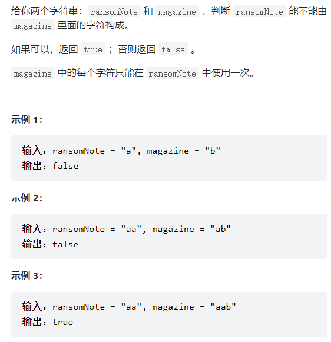
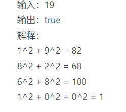

## 理论基础

### 哈希表

- **哈希表（散列表）**是根据关键码（索引）的值而直接进行访问的数据结构。

- **一般哈希表都是用来快速判断一个元素是否出现集合里。**

  要**枚举的话时间复杂度是O(n)**，但如果使用哈希表的话， 只需要**O(1)**就可以做到。

### 哈希函数

哈希函数如下图所示，通过hashCode把名字转化为数值，一般hashcode是通过特定编码方式，可以将其他数据格式转化为不同的数值，这样就把学生名字映射为哈希表上的索引数字了


此时为了保证映射出来的索引数值都落在哈希表上，我们会在再次对数值做一个**取模的操作**，就要我们就保证了学生姓名一定可以映射到哈希表上了。

如果**学生的数量大于哈希表的大小**，此时就算哈希函数计算的再均匀，也避免不了会**有几位学生的名字同时映射到哈希表** **同一个索引下标的位置**。

接下来==**哈希碰撞**==登场


### 哈希碰撞

多个value碰撞到同一个key下：


一般哈希碰撞有两种解决方法， 拉链法和线性探测法。

- 拉链法


刚刚小李和小王在索引1的位置发生了冲突，发生**冲突的元素都被存储在链表中**。

数据规模是dataSize， 哈希表的大小为tableSize）

其实拉链法就是要选择适当的哈希表的大小，这样既不会因为数组空值而浪费大量内存，也不会因为链表太长而在查找上浪费太多时间。

- 线性探测法

例如冲突的位置，放了小李，那么就向下找一个空位放置小王的信息。所以**要求tableSize一定要大于dataSize** ，要不然哈希表上就没有空置的位置来存放 冲突的数据了。如图所示：


### 常见的三种hash结构

- 数组

- set （集合）

- map(映射)

  | 集合               | 底层实现 | 是否有序 | 数值是否可以重复 | 能否更改数值 | 查询效率 | 增删效率 |
  | ------------------ | -------- | -------- | ---------------- | ------------ | -------- | -------- |
  | std::set           | 红黑树   | 有序     | 否               | 否           | O(log n) | O(log n) |
  | std::multiset      | 红黑树   | 有序     | 是               | 否           | O(logn)  | O(logn)  |
  | std::unordered_set | 哈希表   | 无序     | 否               | 否           | O(1)     | O(1)     |

| 映射               | 底层实现 | 是否有序 | 数值是否可以重复 | 能否更改数值 | 查询效率 | 增删效率 |
| ------------------ | -------- | -------- | ---------------- | ------------ | -------- | -------- |
| std::map           | 红黑树   | key有序  | key不可重复      | key不可修改  | O(logn)  | O(logn)  |
| std::multimap      | 红黑树   | key有序  | key可重复        | key不可修改  | O(log n) | O(log n) |
| std::unordered_map | 哈希表   | key无序  | key不可重复      | key不可修改  | O(1)     | O(1)     |

### 总结

**当我们遇到了要快速判断一个元素是否出现集合里的时候，就要考虑哈希法**。

但是哈希法也是**牺牲了空间换取了时间**，因为我们要使用额外的数组，set或者是map来存放数据，才能实现快速的查找。


## 赎信金 esay

[赎金信](https://leetcode.cn/problems/ransom-note/)



### 思路

利用数组映射，因为输入为小写英文字母，因此可以映射到一个hash（这里用数组）里。python用ord

```python
class Solution:
    def canConstruct(self, ransomNote: str, magazine: str) -> bool:
        res1 = [0]*26 #小写字母
        for  i in range(len(magazine)):
            ## ord将字符映射成整型 - ord("a")可以得到index
            res1[ord(magazine[i])-ord("a")] +=1
        for  j in range(len(ransomNote)):
            res1[ord(ransomNote[j])-ord("a")] -=1
            if res1[ord(ransomNote[j])-ord("a")]<0:
                return False
        return True
```


## 快乐树



```python
class Solution:
    def isHappy(self, n: int) -> bool:
        
        # sum_set = set() #有重复的，则会无限煦暖
        # sum_ = 0
        # while(sum_ != 1):
        #     # l_to_str = str(n)
        #     sum_ = 0
        #     ##s算x*2 +y*2
            
        #     while n:
        #         sum_ += (n % 10) ** 2
        #         n = n // 10
        #     # for i in l_to_str:
        #     #     n += int(i)**2
        #     n = sum_
        #     if sum_ in sum_set:
        #         return False
        #         break
        #     else:
        #         sum_set.add(sum_)
        # return True


        hashset = set()
        square_sum =n
        while square_sum != 1:
            a = str(square_sum)
            square_sum = 0
            for i in a:
                square_sum += int(i)**2
            if square_sum not in hashset:
                hashset.add(square_sum)
            else:
                return False
        return True
```


## 两数之和

给定一个整数数组 nums 和一个目标值 target，请你在该数组中找出和为目标值的那 两个 整数，并返回他们的数组下标。

你可以假设每种输入只会对应一个答案。但是，数组中同一个元素不能使用两遍。

**示例:**

给定 nums = [2, 7, 11, 15], target = 9

因为 nums[0] + nums[1] = 2 + 7 = 9

所以返回 [0, 1]

给定一个整数数组 nums 和一个目标值 target，请你在该数组中找出和为目标值的那 两个 整数，并返回他们的数组下标。

你可以假设每种输入只会对应一个答案。但是，数组中同一个元素不能使用两遍。

```python
def twoSum(self, nums: List[int], target: int) -> List[int]:
        dic= {}
        for index,value in enumerate(nums):
            if target-value in dic:
                return [dic[target-value],index]
            else:
                dic[value] = index
```


## 三数之和

[15. 三数之和 - 力扣（LeetCode）](https://leetcode.cn/problems/3sum/submissions/)

给你一个整数数组 nums ，判断是否存在三元组 [nums[i], nums[j], nums[k]] 满足 i != j、i != k 且 j != k ，同时还满足 nums[i] + nums[j] + nums[k] == 0 。请

**你返回所有和为 0 且不重复的三元组。**

**注意：答案中不可以包含重复的三元组。**

```
输入：nums = [-1,0,1,2,-1,-4]
输出：[[-1,-1,2],[-1,0,1]]
解释：
nums[0] + nums[1] + nums[2] = (-1) + 0 + 1 = 0 。
nums[1] + nums[2] + nums[4] = 0 + 1 + (-1) = 0 。
nums[0] + nums[3] + nums[4] = (-1) + 2 + (-1) = 0 。
不同的三元组是 [-1,0,1] 和 [-1,-1,2] 。
注意，输出的顺序和三元组的顺序并不重要。


```


### 思路

利用**双指针策略**，Hash法并不合适，，因为在**去重的操作**中有很多细节需要注意。


拿这个nums数组来举例，首先将数组排序，然后有一层for循环，i从下标0的地方开始，同时定一个下标left 定义在i+1的位置上，定义下标right 在数组结尾的位置上。

依然还是在数组中找到 abc 使得a + b +c =0，我们这里相当于 a = nums[i]，b = nums[left]，c = nums[right]。

接下来如何移动left 和right呢， 如果**nums[i] + nums[left] + nums[right] > 0 就说明 此时三数之和大**了，因为数组是排序后了，所以**right下标就应该向左移动，这样才能让三数之和小一些**。

如果 **nums[i] + nums[left] + nums[right] < 0 说明 此时 三数之和小**了，**left 就向右移动**，**才能让三数之和大一**些，直到left与right相遇为止。

时间复杂度：O(n^2)。


- 去重 逻辑思考，三个数的去重，a,b,c

  - **a去重**

  a 如果重复了怎么办，a是nums里遍历的元素，那么应该直接跳过去。**判断 nums[i] 与 nums[i + 1]是否相同，还是判断 nums[i] 与 nums[i-1] 是否相同**.==不同==

  前者，**直接把三元组(结果中)出现重复的情况pass**了

  **我们要做的是 不能有重复的三元组，但三元组内的元素是可以重复的！**

  - **b与c的去重**
  
    在碰到重复指针时，移动使其不重复。

```text
while (right > left) {
    if (nums[i] + nums[left] + nums[right] > 0) {
        right--;
        // 去重 right
        while (left < right && nums[right] == nums[right + 1]) right--;
    } else if (nums[i] + nums[left] + nums[right] < 0) {
        left++;
        // 去重 left
        while (left < right && nums[left] == nums[left - 1]) left++;
    } else {
    }
}
```

### 答案

```python
class Solution:
    def threeSum(self, nums: List[int]) -> List[List[int]]:
        nums.sort() ## 
        res = []
        for i in range(len(nums)):
            if nums[i] >0:
                break
             
            ## a去重
            if i>= 1 and nums[i] == nums[i-1]:
                continue
            left = i+1
            right = len(nums)-1
            while left<right:
                # 指针移动
                if nums[i]+nums[left]+nums[right]>0:
                    right-=1
                elif nums[i]+nums[left]+nums[right]<0:
                    left +=1
                else:
                    ## 找到了移动指针去重，去重b,c
                    res.append([nums[i],nums[left],nums[right]])
                    while  left < right and nums[left] == nums[left+1]:
                        left +=1
                    while left < right and nums[right] ==  nums[right-1]:
                        right -=1
                    left += 1
                    right -= 1
        return res  
```


## 四数之和

[18. 四数之和 - 力扣（LeetCode）](https://leetcode.cn/problems/4sum/)

   给你一个由 n 个整数组成的数组 nums ，和一个目标值 target 。请你找出并返回满足下述全部条件且不重复的四元组 [nums[a], nums[b], nums[c], nums[d]] （若两个四元组元素一一对应，**则认为两个四元组重复**）：

0 <= a, b, c, d < n
a、b、c 和 d 互不相同
nums[a] + nums[b] + nums[c] + nums[d] == target
你可以按 任意顺序 返回答案 。

​       

### 思路

比三数之和多一个for循环


#### 答案

```python
class Solution:
    def fourSum(self, nums: List[int], target: int) -> List[List[int]]:
        nums.sort() ## 
        res = []
        for i in range(len(nums)):
            # 这里要注意 ，因为target不一定为0
            # if nums[i] >target:
            #     break
            if i>= 1 and nums[i] == nums[i-1]:
                continue
            for j in range(i+1,len(nums)):
                if j>= i+2 and nums[j] == nums[j-1]:
                    continue
                left = j+1
                right = len(nums)-1
                while left<right:
                    # 指针移动
                    if nums[i]+nums[j]+nums[left]+nums[right]>target:
                        right-=1
                    elif nums[i]+nums[j]+nums[left]+nums[right]<target:
                        left +=1
                    else:
                        ## 找到了移动指针去重
                        res.append([nums[i],nums[j],nums[left],nums[right]])
                        while left != right and nums[left] ==  nums[left+1]:
                            left +=1
                        while left != right and nums[right] ==  nums[right-1]:
                            right -=1
                        left += 1
                        right -= 1
        return res
```


## 四数相加II

给你四个整数数组 nums1、nums2、nums3 和 nums4 ，数组长度都是 n ，请你计算有多少个元组 (i, j, k, l) 能满足：

```
0 <= i, j, k, l < n
nums1[i] + nums2[j] + nums3[k] + nums4[l] == 0
```

```
输入：nums1 = [1,2], nums2 = [-2,-1], nums3 = [-1,2], nums4 = [0,2]
输出：2
解释：
两个元组如下：
1. (0, 0, 0, 1) -> nums1[0] + nums2[0] + nums3[0] + nums4[1] = 1 + (-2) + (-1) + 2 = 0
2. (1, 1, 0, 0) -> nums1[1] + nums2[1] + nums3[0] + nums4[0] = 2 + (-1) + (-1) + 0 = 0

来源：力扣（LeetCode）
链接：https://leetcode.cn/problems/4sum-ii
著作权归领扣网络所有。商业转载请联系官方授权，非商业转载请注明出处。
```

### 思路

**本题是使用哈希法的经典题目，而[0015.三数之和 (opens new window)](https://programmercarl.com/0015.三数之和.html)，[0018.四数之和 (opens new window)](https://programmercarl.com/0018.四数之和.html)并不合适使用哈希法**，因为**三数之和和四数之和这两道题目使用哈希法在不超时的情况下做到对结果去重是很困难的**，很有多细节需要处理。

本题解题步骤：

1. 首先定义 一个unordered_map，key放a和b两数之和，value 放a和b两数之和出现的次数。
2. 遍历大A和大B数组，统计两个数组元素之和，和出现的次数，放到map中。
3. 定义int变量count，用来统计 a+b+c+d = 0 出现的次数。
4. 在遍历大C和大D数组，找到如果 0-(c+d) 在map中出现过的话，就用count把map中key对应的value也就是出现次数统计出来。
5. 最后返回统计值 count 就可以了

```python
class Solution:
    def fourSumCount(self, nums1: List[int], nums2: List[int], nums3: List[int], nums4: List[int]) -> int:
        dic = {}
        cnt = 0
        
        # 首先固定住两个，用字典计数两个和为
        for n1 in nums1:
            for n2 in nums2:
                if n1+n2 not in dic:
                    dic[n1+n2] = 1
                else:
                    dic[n1+n2] += 1
        for n3 in nums3:
            for n4 in nums4:
                ## 剩下的两数和
                if (0 - (n3+n4)) in dic:
                    cnt +=dic[(0 - (n3+n4))] ## 获取两数和的出现次数，重复出现则加进去
        return cnt
```


