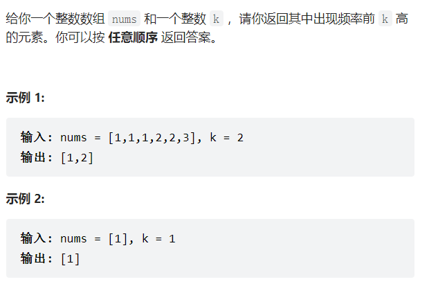

## 1、简介

**堆栈（Stack）**：简称为栈。一种**线性表数据结构**，是一种只允许在表的一端进行插入和删除操作的线性表。

我们把栈中允许插入和删除的一端称为 **「栈顶（top）」**；另一端则称为 **「栈底（bottom）」**。当表中没有任何数据元素时，称之为 **「空栈」**。

堆栈有两种基本操作：**「插入操作」** 和 **「删除操作」**。

- 栈的插入操作又称为「入栈」或者「进栈」。
- 栈的删除操作又称为「出栈」或者「退栈」。


简单来说，栈是一种 **「后进先出（Last In First Out）」** 的线性表，简称为 **「LIFO 结构」**。


- **「线性表」**。

栈首先是一个线性表，栈中元素具有前驱后继的线性关系。栈中元素按照 a1,a2,…,an 的次序依次进栈。栈顶元素为 an。


- **「后进先出原则」**。

根据堆栈的定义，每次删除的总是堆栈中当前的**栈顶元素**，即最后**进入堆栈的元素**。而在进栈时，最先进入**堆栈的元素一定在栈底**，最后进入堆栈的元素一定在栈顶。也就是说，元素进入堆栈或者退出退栈是按照「**后进先出（Last In First Out）**」的原则进行的。


## 2、堆栈的顺序存储与链式存储

和线性表类似，栈有两种存储表示方法:[**顺序栈**]和**链式栈**


## 3、堆栈的应用

堆栈是算法和程序中最常用的辅助结构，其的应用十分广泛。堆栈基本应用于两个方面：

- 使用堆栈可以很方便的保存和取用信息，因此长被用作算法和程序中的辅助存储结构，临时保存信息，供后面操作中使用。
  - 例如：操作系统中的函数调用栈，浏览器中的前进、后退功能。
- 堆栈的后进先出规则，可以保证特定的存取顺序。
  - 例如：翻转一组元素的顺序、铁路列车车辆调度。


## 例题

### 用栈实现队列

 [ 用栈实现队列](https://leetcode.cn/problems/implement-queue-using-stacks/)

请你仅使用两个栈实现先入先出队列。队列应当支持一般队列支持的所有操作（push、pop、peek、empty）：

实现 MyQueue 类：

void push(int x) 将元素 x 推到队列的末尾
int pop() 从队列的开头移除并返回元素
int peek() 返回队列开头的元素
boolean empty() 如果队列为空，返回 true ；否则，返回 false

```
输入：
["MyQueue", "push", "push", "peek", "pop", "empty"]
[[], [1], [2], [], [], []]
输出：
[null, null, null, 1, 1, false]

解释：
MyQueue myQueue = new MyQueue();
myQueue.push(1); // queue is: [1]
myQueue.push(2); // queue is: [1, 2] (leftmost is front of the queue)
myQueue.peek(); // return 1
myQueue.pop(); // return 1, queue is [2]
myQueue.empty(); // return false

```


#### 思路

使用两个栈，入栈和出栈实现队列

 


#### 答案

```python
class MyQueue:

    def __init__(self):
        self.stack_in =[]
        self.stack_out =[]

    def push(self, x: int) -> None:
        self.stack_in.append(x) #stack_in入栈


    def pop(self) -> int:
        if self.empty(): #如为空，则输出None
            return None
        if self.stack_out:#如果出栈不为空，则出一个
            return self.stack_out.pop()
        else: #如果出栈没数,把入栈的数全部存放在出栈里（想当于调个头)
            for i in range(len(self.stack_in)):
                self.stack_out.append(self.stack_in.pop())
            return self.stack_out.pop()


    def peek(self) -> int:
        ans = self.pop() #弹出出栈里的第一个元素
        self.stack_out.append(ans) #再放获取
        return ans


    def empty(self) -> bool:
        """
        只要in或者out有元素，说明队列不为空
        """
        return not (self.stack_in or self.stack_out)


# Your MyQueue object will be instantiated and called as such:
# obj = MyQueue()
# obj.push(x)
# param_2 = obj.pop()
# param_3 = obj.peek()
# param_4 = obj.empty()
```


### 用队列实现栈

#### 思路


#### 答案

```python
class MyStack:

    def __init__(self):
        self.que1 = []
        self.que2 = [] ## 辅助队列


    def push(self, x: int) -> None:
        ### 放辅助queque里
        self.que2.append(x)
        while self.que1:
            tmp = self.que1.pop(0)
            self.que2.append(tmp)
        ## 调换que1 和que2
        self.que1,self.que2 = self.que2,self.que1


    def pop(self) -> int:
        return self.que1.pop(0)


    def top(self) -> int:
        return self.que1[0]


    def empty(self) -> bool:
        return len(self.que1) ==0


# Your MyStack object will be instantiated and called as such:
# obj = MyStack()
# obj.push(x)
# param_2 = obj.pop()
# param_3 = obj.top()
# param_4 = obj.empty()
```


### 有效的括号 esay

[20. 有效的括号 - 力扣（LeetCode）](https://leetcode.cn/problems/valid-parentheses/)

给定一个只包括 '('，')'，'{'，'}'，'['，']' 的字符串 s ，判断字符串是否有效。

有效字符串需满足：

左括号必须用相同类型的右括号闭合。
左括号必须以正确的顺序闭合。
每个右括号都有一个对应的相同类型的左括号。


示例 1：

输入：s = "()"
输出：true
示例 2：

输入：s = "()[]{}"
输出：true
示例 3：

输入：s = "(]"
输出：false

```python
class Solution:
    def isValid(self, s: str) -> bool:
        stack = []
        ## 
        for item in s:
            if item == '(':
                stack.append(')')
            elif item == '[':
                stack.append(']')
            elif item == '{':
                stack.append('}')
             ## stack为空
            elif not stack or stack[-1] != item:
                return False
            else:
                stack.pop()
        
        return True if not stack else False
```


### 基本计算器||  medium

[227. 基本计算器 II - 力扣（LeetCode）](https://leetcode.cn/problems/basic-calculator-ii/)

给你一个字符串表达式 s ，请你实现一个基本计算器来计算并返回它的值。

整数除法仅保留整数部分。

```python
class Solution:
    def calculate(self, s: str) -> int:
        size = len(s)
        stack = []
        op = '+'
        index = 0
        while index < size:
            # 过筛空格
            if s[index] == ' ':
                index += 1
                continue
            if s[index].isdigit():
                # 获得数字
                num = ord(s[index]) - ord('0')
                while index + 1 < size and s[index+1].isdigit():
                    index += 1
                    num = 10 * num + ord(s[index]) - ord('0') #个位，十位,...
                
                if op == '+':
                    stack.append(num)
                elif op == '-':
                    stack.append(-num)
                elif op == '*':
                    top = stack.pop()
                    stack.append(top * num)
                elif op == '/':
                    top = stack.pop()
                    stack.append(int(top / num))
            elif s[index] in "+-*/":
                op = s[index] #记住上一个符号
            index += 1
        return sum(stack)
```


### 最小栈


```pyhton
输入：
["MinStack","push","push","push","getMin","pop","top","getMin"]
[[],[-2],[0],[-3],[],[],[],[]]

输出：
[null,null,null,null,-3,null,0,-2]

解释：
MinStack minStack = new MinStack();
minStack.push(-2);
minStack.push(0);
minStack.push(-3);
minStack.getMin();   --> 返回 -3.
minStack.pop();
minStack.top();      --> 返回 0.
minStack.getMin();   --> 返回 -2.

```


#### 解法1：

```PYTHON
class MinStack:

    def __init__(self):
        self.stack = []

    def push(self, val: int) -> None:
        self.stack.append(val)

    def pop(self) -> None:
        
        return self.stack.pop()
        


    def top(self) -> int:
        return self.stack[-1]


    def getMin(self) -> int:
        _min  = float("inf")
        for item in self.stack:
            _min = min(_min,item)
        return _min


# Your MinStack object will be instantiated and called as such:
# obj = MinStack()
# obj.push(val)
# obj.pop()
# param_3 = obj.top()
# param_4 = obj.getMin()
```


#### 解法2

利用辅助栈，用来记录，每push一个val，此时的最小值

```python
class MinStack:

    def __init__(self):
        self.stack = [] ##  正常栈
        self.aux_stack = [] ##辅助栈

    def push(self, val: int) -> None:
        ## 辅助栈用来存放最小值，栈顶为最小值

        """
        1、 [-2]
            [-2]
        2、[-2,0]
           [-2,-2] ### -2《0，append(-2)
        3、
            [-2,0,-3]
            [-2,-2,-3] ### -3<-2，append(-3)   gei_min = -3

        =======pop
        4、【-2，0】
            [-2,-2]  #### gei_min = -2
        
        """


        self.stack.append(val)
        if not self.aux_stack:
            self.aux_stack.append(val)
        else:
            if self.aux_stack[-1] >= val:
                self.aux_stack.append(val)
            else:
                self.aux_stack.append(self.aux_stack[-1])

    def pop(self) -> None:
        
        self.stack.pop()
        self.aux_stack.pop()
        


    def top(self) -> int:
        return self.stack[-1]


    def getMin(self) -> int:
        return self.aux_stack[-1]
        # _min  = float("inf")
        # for item in self.stack:
        #     _min = min(_min,item)
        # return _min


# Your MinStack object will be instantiated and called as such:
# obj = MinStack()
# obj.push(val)
# obj.pop()
# param_3 = obj.top()
# param_4 = obj.getMin()
```


### 每日温度
[739. 每日温度 - 力扣（LeetCode）](https://leetcode.cn/problems/daily-temperatures/)

给定一个整数数组 temperatures ，表示每天的温度，返回一个数组 answer ，其中 answer[i] 是指对于第 i 天，下一个更高温度出现在几天后。如果气温在这之后都不会升高，请在该位置用 0 来代替。

 

示例 1:

输入: temperatures = [73,74,75,71,69,72,76,73]
输出: [1,1,4,2,1,1,0,0]


#### 思路

暴力:

```python
class Solution {
    public int[] dailyTemperatures(int[] T) {

        int[] res = new int[T.length];
        for (int i = 0; i < T.length - 1; i++) {
            for (int j =  i + 1; j < T.length; j++) {
                if (T[j] > T[i]) {
                    res[i] = j - i;
                    break;
                }
            }
        }
        return res;
    }
}
```


单调栈:

1. 首先，将答案数组 `ans` 全部赋值为 0。然后遍历数组每个位置元素。
2. 如果栈为空，则将当前元素的下标入栈。
3. 如果栈不为空，且当前数字大于栈顶元素对应数字，则栈顶元素出栈，并计算下标差。
4. 此时当前元素就是栈顶元素的下一个更高值，将其下标差存入答案数组 `ans` 中保存起来，判断栈顶元素。
5. 直到当前数字小于或等于栈顶元素，则停止出栈，将当前元素下标入栈。
6. 最后输出答案数组 `ans`。

```python
class Solution:
    def dailyTemperatures(self, temperatures: List[int]) -> List[int]:
        res = [0]*len(temperatures)
        stack = []
        for i in range(len(temperatures)):
            while stack and temperatures[i]>temperatures[stack[-1]]:
                index = stack.pop()
                res[index] = i- index
            stack.append(i)
        return res

```


### 逆波特兰表达式求值

[150. 逆波兰表达式求值 - 力扣（LeetCode）](https://leetcode.cn/problems/evaluate-reverse-polish-notation/)

有效的算符包括 +、-、*、/ 。每个运算对象可以是整数，也可以是另一个逆波兰表达式。

注意 两个整数之间的除法只保留整数部分。

可以保证给定的逆波兰表达式总是有效的。换句话说，表达式总会得出有效数值且不存在除数为 0 的情况。

 

示例 1：

输入：tokens = ["2","1","+","3","*"]
输出：9
解释：该算式转化为常见的中缀算术表达式为：((2 + 1) * 3) = 9
示例 2：

输入：tokens = ["4","13","5","/","+"]
输出：6
解释：该算式转化为常见的中缀算术表达式为：(4 + (13 / 5)) = 6


#### 答案

**使用栈**

```python
class Solution:
    def evalRPN(self, tokens: List[str]) -> int:
        
        stack = []
        res = 0
        # tokens = ["10","6","9","3","+","-11","*","/","*","17","+","5","+"]
        for i in tokens:
            # if i.isdigit():
            #     stack.append(int(i))
            if i[-1].isdigit(): # I的最后一个字符为数组(防止数字识别不出的情况)
                stack.append(int(i))
            if i == "+":
                sum1 = stack.pop()
                sum2 = stack.pop()
                res = (sum1+sum2)
                stack.append(res)
            if i== "-":
                sup1 = stack.pop() ##被减数
                sup2 = stack.pop() ##减数
                res = (sup2 - sup1)
                stack.append(res)
            if i== "*":
                mul1 = stack.pop()
                mul2 = stack.pop()
                res = (mul2*mul1)
                stack.append(res)
            if i== "/":
                d1 = stack.pop()
                d2 = stack.pop()
                res = int(d2/d1) #整除 
                stack.append(res)
        return stack[-1]

```


### 字符串解码 med

[394. 字符串解码 - 力扣（LeetCode）](https://leetcode.cn/problems/decode-string/)


#### 思路

用栈记录两个值，遇到[则输入

遇到]则输出

#### 答案

```python
class Solution:
    def decodeString(self, s: str) -> str:
        stack = []  # (str, int) 记录左括号之前的字符串和左括号外的上一个数字
        num = 0
        res = ""  # 实时记录当前可以提取出来的字符串
        for c in s:
            if c.isdigit():
                num = num * 10 + int(c) 
            elif c == "[":
                stack.append((res, num))
                res, num = "", 0 #重置res和num
            elif c == "]":
                top = stack.pop()
                res = top[0] + res * top[1] 
            else:
                res += c
        return res
```


### 前k个高频元素
给你一个整数数组 nums 和一个整数 k ，请你返回其中出现频率前 k 高的元素。你可以按 任意顺序 返回答案.



#### 思路

1. 要统计元素出现频率

2. 对频率排序

3. 找出前K个高频元素

   **对hash频率进行排序，使用一种容器适配器==优先级队列==**

定义:

其实**就是一个披着队列外衣的堆**，因为优先级队列对外接口只是从**队头取元素，从队尾添加元素，再无其他取元素的方式，看起来就是一个队列**。

而且优先级队列**内部元素是自动依照元素的权值排列**。那么它是如何有序排列的呢？

缺省情况下**priority_queue利用max-heap（大顶堆）完成对元素的排序**，这个大**顶堆是以vector为表现形式的complete binary tree（完全二叉树）**。

堆：

**堆是一棵完全二叉树，树中每个结点的值都不小于（或不大于）其左右孩子的值。** 如果父亲结点是大于等于左右孩子就是大顶堆，小于等于左右孩子就是小顶堆。

所以大家经常说的**大顶堆（堆头是最大元素**），**小顶堆（堆头是最小元素）**，如果懒得自己实现的话，就直接用**priority_queue**（优先级队列）就可以了，底层实现都是一样的，从小到大排就是小顶堆，从大到小排就是大顶堆。

使用大顶堆就要把所有元素都进行排序，那能不能只排序k个元素呢？

**所以我们要用小顶堆，因为要统计最大前k个元素，只有小顶堆每次将最小的元素弹出，最后小顶堆里积累的才是前k个最大元素。**

寻找前k个最大元素流程如图所示：（图中的频率只有三个，所以正好构成一个大小为3的小顶堆，如果频率更多一些，则用这个小顶堆进行扫描）


#### 答案

- 解法一：

  使用hash-table加排序

  ```python
  class Solution:
      def topKFrequent(self, nums: List[int], k: int) -> List[int]:
          dic = {}
          for i in nums:
              if i not in dic:
                  dic[i] =1
              else:
                  dic[i]+=1
          res = []
          for i in dic:
              res.append((i,dic[i]))
          res.sort(key =lambda x:-x[1])
          ans =[]
          for i in range(k):
              ans.append(res[i][0])
          return ans
  ```

-  解法二

  **优先队列**

  ```python
  #时间复杂度：O(nlogk)
  #空间复杂度：O(n)
  import heapq
  class Solution:
      def topKFrequent(self, nums: List[int], k: int) -> List[int]:
          #要统计元素出现频率
          map_ = {} #nums[i]:对应出现的次数
          for i in range(len(nums)):
              map_[nums[i]] = map_.get(nums[i], 0) + 1
          
          #对频率排序
          #定义一个小顶堆，大小为k
          pri_que = [] #小顶堆
          
          #用固定大小为k的小顶堆，扫面所有频率的数值
          for key, freq in map_.items():
              heapq.heappush(pri_que, (freq, key))
              if len(pri_que) > k: #如果堆的大小大于了K，则队列弹出，保证堆的大小一直为k
                  heapq.heappop(pri_que)
          
          #找出前K个高频元素，因为小顶堆先弹出的是最小的，所以倒序来输出到数组
          result = [0] * k
          for i in range(k-1, -1, -1):
              result[i] = heapq.heappop(pri_que)[1]
          return result
  ```

  

