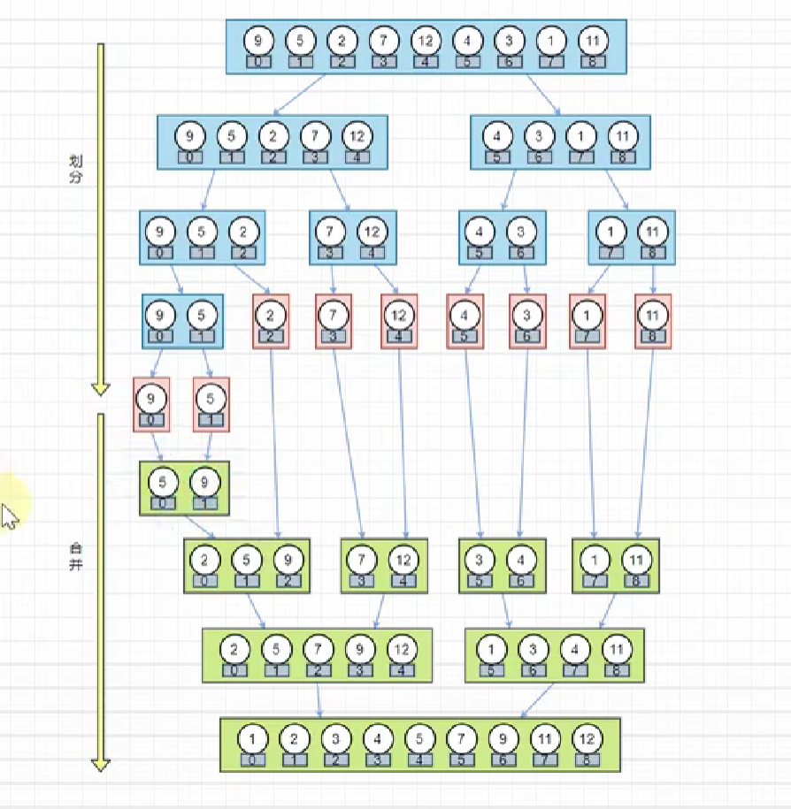

## 汇总


### 冒泡排序

最快:正序

最慢:反序


```python
def bubbleSort(arr):
    for i in range(1, len(arr)):
        for j in range(0, len(arr)-i):
            if arr[j] > arr[j+1]:
                arr[j], arr[j + 1] = arr[j + 1], arr[j]
    return arr
```


### 选择排序

- 首先在未排序序列中找到最小（大）元素，存放到排序序列的起始位置。

- 再从剩余未排序元素中继续寻找最小（大）元素，然后放到已排序序列的末尾。

- 重复第二步，直到所有元素均排序完毕。

  

```python
def select_sort(arr):
    for i in range(len(arr)-1):
        min_index = i
        for j in range(i+1,len(arr)):
            if arr[j]<arr[min_index]:
                min_index = j
        if i!= min_index: 
            arr[i],arr[min_index] = arr[min_index],arr[i]
    return arr
```


### 插入排序

将第一待排序序列第一个元素看做一个有序序列，把第二个元素到最后一个元素当成是未排序序列。

从头到尾依次扫描未排序序列，将扫描到的每个元素插入有序序列的适当位置。（如果待插入的元素与有序序列中的某个元素相等，则将待插入元素插入到相等元素的后面。）


```python
arr = [2,4,5,1,3]
def insert_sort(arr):
    for i in range(len(arr)):
        preIndex = i-1
        current = arr[i]
        while preIndex >= 0 and arr[preIndex] > current:
            arr[preIndex+1] = arr[preIndex]
            preIndex-=1 
        arr[preIndex+1] = current
    return arr
```


### 希尔排序
希尔排序，也称递减增量排序算法，是**插入排序的一种更高效的改进版本**。但希尔排序是**非稳定**排序算法。

希尔排序是基于插入排序的以下两点性质而提出改进方法的：

插入排序在对几乎已经排好序的数据操作时，效率高，即可以达到线性排序的效率；
但插入排序一般来说是低效的，因为**插入排序每次只能将数据移动一位；**
希尔排序的基本思想是：**先将整个待排序的记录序列分割成为若干子序列分别进行直接插入排序，待整个序列中的记录"基本有序"时，再对全体记录进行依次直接插入排序。**

1. 算法步骤
选择一个增量序列 t1，t2，……，tk，其中 ti > tj, tk = 1；

按增量序列个数 k，对序列进行 k 趟排序；

每趟排序，根据对应的增量 ti，将待排序列分割成若干长度为 m 的子序列，分别对各子表进行直接插入排序。仅增量因子为 1 时，整个序列作为一个表来处理，表长度即为整个序列的长度。


### 归并排序
归并排序（Merge sort）是建立在归并操作上的一种有效的排序算法。该算法是采用分治法（Divide and Conquer）的一个非常典型的应用。

作为一种典型的分而治之思想的算法应用，归并排序的实现由两种方法：

自上而下的递归（**所有递归的方法都可以用迭代重写，所以就有了第 2 种方法**）；
自下而上的迭代；

1. 申请空间，使其大小为两个已经排序序列之和，该空间用来存放合并后的序列；
2. 设定两个指针，最初位置分别为两个已经排序序列的起始位置；

3. 比较两个指针所指向的元素，选择相对小的元素放入到合并空间，并移动指针到下一位置；

4. 重复步骤 3 直到某一指针达到序列尾；

5. 将另一序列剩下的所有元素直接复制到合并序列尾。




  。


```python
arr= [2,3,5,1,4]
def merge_sort(arr):
    ## 递归终止条件
    if(len(arr)<2):
        return arr
    ## 划分
    ## 找中间点位置
    mid = int(len(arr)/2)
    # 递归左半区
    left = arr[:mid]
    # 递归左半区
    right = arr[mid:]
    return merge(merge_sort(left),merge_sort(right))


def merge(left,right):
    ## 合并
    res = []
    while left and right:
        if left[0]<=right[0]:
            res.append(left.pop(0)) #res传入小的那一方
        else:
            res.append(right.pop(0))
    while left:
        #当left没传完，right传完
        res.append(left.pop(0)) #从第一个往前穿
    
    while right:
        #当left没传完，right传完
        res.append(right.pop(0)) #从第一个往前穿
    return res
merge_sort(arr)
```


信息部集中，区域很多，货主很少。


### 快速排序

快速排序是由东尼·霍尔所发展的一种排序算法。在平均状况下，排序 n 个项目要 Ο(nlogn) 次比较。在最坏状况下则需要 Ο(n2) 次比较，但这种状况并不常见。事实上，快速排序通常明显比其他 Ο(nlogn) 算法更快，因为它的内部循环（inner loop）可以在大部分的架构上很有效率地被实现出来。

快速排序使用分治法（Divide and conquer）策略来把一个串行（list）分为两个子串行（sub-lists）。

虽然 Worst Case 的时间复杂度达到了 O(n²)，但是人家就是优秀，在大多数情况下都比平均时间复杂度为 O(n logn) 的排序算法表现要更好，可是这是为什么呢，我也不知道。好在我的强迫症又犯了，查了 N 多资料终于在《算法艺术与信息学竞赛》上找到了满意的答案：

> 快速排序的最坏运行情况是 O(n²)，比如说顺序数列的快排。但它的平摊期望时间是 O(nlogn)，且 O(nlogn) 记号中隐含的常数因子很小，比复杂度稳定等于 O(nlogn) 的归并排序要小很多。所以，对绝大多数顺序性较弱的随机数列而言，快速排序总是优于归并排序。


- 思想
  1. 选定Pivot中心轴
  2. 将大于pivot的数字放在pivot的右边
  3. 将小于Pivot的数字放在pivot的左边
  4. 分别对左右子序列重复前三步操作

```python
arr= [2,3,5,1,0,4]
def partition(arr, left, right):
    pivot = left
    index = pivot+1
    i = index
    while  i <= right:
        if arr[i] < arr[pivot]:
            ## i=3时 index =1 ;i=4时,index =2
            arr[i],arr[index] = arr[index],arr[i] #交换两个位置;交换两个位置;
            ## arr = [2,1,5,3,0,4];arr = [2,1,0,3,5,4]
            index+=1
            ## index :2;index =3
        i+=1
        ## 0和3-1交换 :arr = [1,0,2,5,3,4]
    arr[pivot],arr[index-1] = arr[index-1],arr[pivot]#交换两个位置
    return index-1
            
def quick_sort(arr,left,right):  
    if left < right :#至少两个元素
        mid = partition(arr,left,right) #分割点
        quick_sort(arr,left,mid-1) # 快排[1]
        quick_sort(arr,mid+1,right)# 快排【5,3,4】

quick_sort(arr,0,len(arr)-1)
arr
```

