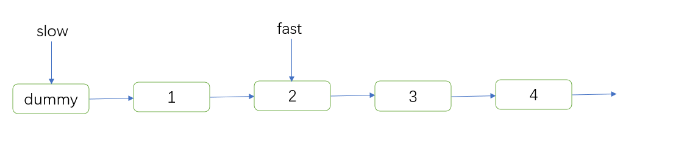

###  链表理论与基础

链表是一种通过指针串联在一起的**线性结构**，每一个节点由两部分组成，一个是**数据域**一个是**指针域**（存放指向下一个节点的指针），最后一个节点的指针域指向**null**（空指针的意思）。

链接的入口节点称为链表的头结点也就是**head**。


****

**单链表**


**双链表**：每一个节点有两个指针域，一个指向下一个节点，一个指向上一个节点。双链表 既可以向前查询也可以向后查询。


**循环链表**

循环链表可以用来解决约瑟夫环问题。


==数组==是在内存中是==连续分布==的，但是**链表**在内存中可**不是连续分布**的。链表是通过指针域的指针链接在内存中各个节点。


#### 链表定义

***  JAVA***

```java
																															public class ListNode {
    // 结点的值
    int val;

    // 下一个结点
    ListNode next;

    // 节点的构造函数(无参)
    public ListNode() {
    }

    // 节点的构造函数(有一个参数)
    public ListNode(int val) {
        this.val = val;
    }

    // 节点的构造函数(有两个参数)
    public ListNode(int val, ListNode next) {
        this.val = val;
        this.next = next;
    }
}
```

***PYTHON***

```python
class ListNode:
    def __init__(self, val, next=None):
        self.val = val
        self.next = next
```

### 移除链表元素 Easy

[203. 移除链表元素 - 力扣（LeetCode）](https://leetcode.cn/problems/remove-linked-list-elements/)

给你一个链表的头节点 `head` 和一个整数 `val` ，请你删除链表中所有满足 `Node.val == val` 的节点，并返回 **新的头节点** 。


```
输入：head = [1,2,6,3,4,5,6], val = 6
输出：[1,2,3,4,5]

```

#### 思路

对于目标节点是head节点，其实**可以设置一个==虚拟头结点==**这样原链表的所有节点就都可以按照统一的方式进行移除了。

来看看如何设置一个虚拟头。依然还是在这个链表中，移除元素1。

==虚拟头节点的作用==:解决对head节点的操作


`return dummyNode->next;`， 这才是新的头结点

#### 答案

```python
# Definition for singly-linked list.
class ListNode:
    def __init__(self, val=0, next=None):
        self.val = val
        self.next = next
class Solution:
    def removeElements(self, head: ListNode, val: int) -> ListNode:
        ## 创建虚拟节点
        dummy_head = ListNode(next = head)
        cur = dummy_head
        while cur.next != None:#下一个节点不为None
            if cur.next.val == val: #如果下一个节点为目标
                cur.next = cur.next.next #下一个节点指向下一个的下一个
            else:
                cur = cur.next
        return dummy_head.next
```


#### 设计链表 med

[707. 设计链表 - 力扣（LeetCode）](https://leetcode.cn/problems/design-linked-list/)

+ get(index)：获取链表中第 index 个节点的值。如果索引无效，则返回-1。
+ addAtHead(val)：在链表的第一个元素之前添加一个值为 val 的节点。插入后，新节点将成为链表的第一个节点。
  addAtTail(val)：将值为 val 的节点追加到链表的最后一个元素。
+ addAtIndex(index,val)：在链表中的第 index 个节点之前添加值为 val  的节点。如果 index 等于链表的长度，则该节点将附加到链表的末尾。如果 index 大于链表长度，则不会插入节点。如果index小于0，则在头部插入节点。
+ deleteAtIndex(index)：如果索引 index 有效，则删除链表中的第 index 个节点。

> MyLinkedList linkedList = new MyLinkedList();
> linkedList.addAtHead(1);
> linkedList.addAtTail(3);
> linkedList.addAtIndex(1,2);   //链表变为1-> 2-> 3
> linkedList.get(1);            //返回2
> linkedList.deleteAtIndex(1);  //现在链表是1-> 3
> linkedList.get(1);            //返回3
##### 答案


```python


# 单链表

class Node:
    
    def __init__(self, val):
        self.val = val
        self.next = None


class MyLinkedList:

    def __init__(self):
        self._head = Node(0)  # 虚拟头部节点
        self._count = 0  # 添加的节点数

    def get(self, index: int) -> int:
        """
        Get the value of the index-th node in the linked list. If the index is invalid, return -1.
        """
        if 0 <= index < self._count:
            node = self._head
            for _ in range(index + 1):
                node = node.next
            return node.val
        else:
            return -1

    def addAtHead(self, val: int) -> None:
        """
        Add a node of value val before the first element of the linked list. After the insertion, the new node will be the first node of the linked list.
        """
        self.addAtIndex(0, val)

    def addAtTail(self, val: int) -> None:
        """
        Append a node of value val to the last element of the linked list.
        """
        self.addAtIndex(self._count, val)

    def addAtIndex(self, index: int, val: int) -> None:
        """
        Add a node of value val before the index-th node in the linked list. If index equals to the length of linked list, the node will be appended to the end of linked list. If index is greater than the length, the node will not be inserted.
        """
        if index < 0:
            index = 0
        elif index > self._count:
            return

        # 计数累加
        self._count += 1

        add_node = Node(val)
        prev_node, current_node = None, self._head
        for _ in range(index + 1):
            prev_node, current_node = current_node, current_node.next
        else:
            prev_node.next, add_node.next = add_node, current_node

    def deleteAtIndex(self, index: int) -> None:
        """
        Delete the index-th node in the linked list, if the index is valid.
        """
        if 0 <= index < self._count:
            # 计数-1
            self._count -= 1
            prev_node, current_node = None, self._head
            for _ in range(index + 1):
                prev_node, current_node = current_node, current_node.next
            else:
                prev_node.next, current_node.next = current_node.next, None


# 双链表
# 相对于单链表, Node新增了prev属性
class Node:
    
    def __init__(self, val):
        self.val = val
        self.prev = None
        self.next = None


class MyLinkedList:

    def __init__(self):
        self._head, self._tail = Node(0), Node(0)  # 虚拟节点
        self._head.next, self._tail.prev = self._tail, self._head
        self._count = 0  # 添加的节点数

    def _get_node(self, index: int) -> Node:
        # 当index小于_count//2时, 使用_head查找更快, 反之_tail更快
        if index >= self._count // 2:
            # 使用prev往前找
            node = self._tail
            for _ in range(self._count - index):
                node = node.prev
        else:
            # 使用next往后找
            node = self._head   
            for _ in range(index + 1):
                node = node.next
        return node

    def get(self, index: int) -> int:
        """
        Get the value of the index-th node in the linked list. If the index is invalid, return -1.
        """
        if 0 <= index < self._count:
            node = self._get_node(index)
            return node.val
        else:
            return -1

    def addAtHead(self, val: int) -> None:
        self._update(self._head, self._head.next, val)

    def addAtTail(self, val: int) -> None:
        """
        Append a node of value val to the last element of the linked list.
        """
        self._update(self._tail.prev, self._tail, val)

    def addAtIndex(self, index: int, val: int) -> None:
        """
        Add a node of value val before the index-th node in the linked list. If index equals to the length of linked list, the node will be appended to the end of linked list. If index is greater than the length, the node will not be inserted.
        """
        if index < 0:
            index = 0
        elif index > self._count:
            return
        node = self._get_node(index)
        self._update(node.prev, node, val)

    def _update(self, prev: Node, next: Node, val: int) -> None:
        """
            更新节点
            :param prev: 相对于更新的前一个节点
            :param next: 相对于更新的后一个节点
            :param val:  要添加的节点值
        """
        # 计数累加
        self._count += 1
        node = Node(val)
        prev.next, next.prev = node, node
        node.prev, node.next = prev, next

    def deleteAtIndex(self, index: int) -> None:
        """
        Delete the index-th node in the linked list, if the index is valid.
        """
        if 0 <= index < self._count:
            node = self._get_node(index)
            # 计数-1
            self._count -= 1
            node.prev.next, node.next.prev = node.next, node.prev
```


### 翻转链表 esay

[力扣题目链接(opens new window)](https://leetcode.cn/problems/reverse-linked-list/)

题意：反转一个单链表。

示例: 输入: 1->2->3->4->5->NULL 输出: 5->4->3->2->1->NULL


#### 思路


#### 答案

```Python
# Definition for singly-linked list.
# class ListNode:
#     def __init__(self, val=0, next=None):
#         self.val = val
#         self.next = next
class Solution:
    def reverseList(self, head: Optional[ListNode]) -> Optional[ListNode]:
        """双指针：交换前一个与后一个的指向"""
        pre = None
        cur = head
        while cur != None:
            tmp = cur.next
            cur.next =pre
            pre = cur
            cur = tmp
        return pre

    def reverseList(self, head: ListNode) -> ListNode:
        """递归法"""
        def reverse(pre,cur):
            if not cur:
                return pre
                
            tmp = cur.next
            cur.next = pre

            return reverse(cur,tmp)
        
        return reverse(None,head)
        
```


### 两两交换链表中的节点 med

给你一个链表，两两交换其中相邻的节点，并返回交换后链表的头节点。你必须在不修改节点内部的值的情况下完成本题（即，只能进行节点交换。

[24. 两两交换链表中的节点 - 力扣（LeetCode）](https://leetcode.cn/problems/swap-nodes-in-pairs/)


#### 思路


#### 答案

```python
class ListNode:
    def __init__(self,val=0,next = None)：
    	self.val = val
        self.next = next
class Solution:
    def swapPairs(self, head):
        # 设置一个虚拟头节点
        dummy = ListNode(next = head)
        cur = dummy
        while cur.next and cur.next.next:
            tmp1 = cur.next
            tmp2 = cur.next.next.next
            cur.next = cur.next.next
            cur.next.next = tmp1
            cur.next.next.next = tmp2
            
            cur = cur.next.next#向下移动2位
        return dummy.next
```


### 删除链表的倒数第N个节点 med


```
输入：head = [1,2,3,4,5], n = 2
输出：[1,2,3,5]
```

#### 思路

- 定义**fast指针和slow指针**，初始值为**虚拟头结点**，如图：

  窗口大小为n，将fast移动n的位置

  

- 移动窗口直至末尾，再使得slow指向跳过下一个

  

#### 答案

```python
# Definition for singly-linked list.
# class ListNode:
#     def __init__(self, val=0, next=None):
#         self.val = val
#         self.next = next
class Solution:
    def removeNthFromEnd(self, head: Optional[ListNode], n: int) -> Optional[ListNode]:
        dummy = ListNode(next = head)
        fast = dummy
        slow = dummy
        # 移动fast到n位置
        k = 0
        while k<n:
            fast = fast.next
            k +=1
        while fast.next:
            slow = slow.next
            fast = fast.next
        slow.next = slow.next.next
        return dummy.next
```


### 合并2个有序链表

 [合并两个有序链表](https://leetcode.cn/problems/merge-two-sorted-lists/)


```python
# Definition for singly-linked list.
# class ListNode:
#     def __init__(self, val=0, next=None):
#         self.val = val
#         self.next = next
class Solution:
    def mergeTwoLists(self, list1: Optional[ListNode], list2: Optional[ListNode]) -> Optional[ListNode]:
        dummy = ListNode(0) ##初始化一个新节点
        cur = dummy
        
        #双指针，只要一个没遍历玩就继续遍历
        while list1 and list2:
            if list2.val>list1.val:#递增存入dummy链表中
                cur.next = list1
                cur = cur.next
                list1 = list1.next
            else:
                cur.next = list2
                cur = cur.next
                list2 = list2.next
        if not list1:#如果list1为空，直接连接另一条量表
            cur.next = list2
        if not list2:
            cur.next = list1
        return dummy.next
```


### 环形链表 esay

```
输入：head = [3,2,0,-4], pos = 1
输出：true
解释：链表中有一个环，其尾部连接到第二个节点。
```


#### 思路

fast和slow各自再走一步， fast和slow就相遇了

这是因为fast是走两步，slow是走一步，**其实相对于slow来说，fast是一个节点一个节点的靠近slow的**，所以fast一定可以和slow重合。


#### 答案

```python
# Definition for singly-linked list.
# class ListNode:
#     def __init__(self, x):
#         self.val = x
#         self.next = None

class Solution:
    def hasCycle(self, head: Optional[ListNode]) -> bool:
        slow = head
        fast = head
        while fast and fast.next:
            slow = slow.next
            fast = fast.next.next
            if slow ==fast:
                return True
        return False
```


### 环形链表2

找环形链表的入口


```
输入：head = [3,2,0,-4], pos = 1
输出：返回索引为 1 的链表节点
解释：链表中有一个环，其尾部连接到第二个节点。
```


#### 思路

- 判断有环

  环形链表 esay

- 环的入口

  


$$
2(x + y) = x + n(y+z) +y
$$
2表示 1个fast相当于走了2*step的slow

左为slow的走距离，右为fast走的步的距离，相遇表示，在某个时刻，二者的距离相等
$$
x+y = n(y+z) \\ x = (n-1)(y+z) +z\\当n =1时，x =z,
\\x = k(y+z)+z
$$


因此只要**一个指针从头节点走，一个指针从第一次相遇节点走，他们势必会在入口相遇！**


#### 答案

```python
# Definition for singly-linked list.
# class ListNode:
#     def __init__(self, x):
#         self.val = x
#         self.next = None

class Solution:
    def detectCycle(self, head: ListNode) -> ListNode:
        ## 判断是否为环形，利用快慢指针进行判断
        fast = head
        slow = head
        while fast and fast.next:
            fast = fast.next.next
            slow = slow.next
            ## 如果找到第一次遇到的点#环形
            if fast == slow:
                ## 构造新的两个指针
                index1 = head
                index2 = fast
                while index1 != index2:
                    index1 = index1.next
                    index2 = index2.next
                return index1
        return None
```


1、货主画像

1、覆盖率高

2、poi逻辑


3.货被多个发货


